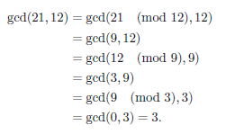
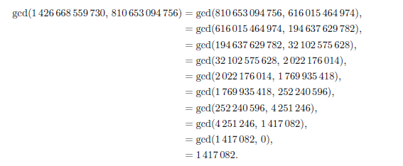

# Mathematical-Cryptography

  

This repository contains Python implementation of algorithms that are used almost everywhere in Mathematical Cryptography. There are several basic algorithms that are used in cryptography over and over again. The ones we are focusing on right now are:

- [Euclidean gcd Algorithm](euclideanalgo.py) 
- [Binary Euclidean Algorithm](bineuclid.py)
- [Extended Euclidean Algorithm](eea.py)

1. [The Euclidean Algorithm](euclideanalgo.py): The case of integers is considered only since it can be easily generalized to polynomials due to the fact that both integers and polynomials allow Euclidean division.
As an example we consider a few examples:

> **Case 1: For Small Numbers:**

> **Case 2: For larger numbers:**

> **Caveat:** Euclidean Algorithm is inefficient since it is easy for a computer to perform addition and multiplication rather than to take remainders and quotients.

2. [Binary Euclidean Algorithm](bineuclid.py): It should not be hard to understand that it is easier for a computer to divide by two since it can simply be accomplished by a cheaper operation (bit shift). This is exactly how the binary Euclidean Algorithm works by removing any power of two in the gcd. The Binary version of Euclidean Algorithm is efficient compared to Euclidean gcd Algorithm.

3. [Extended Euclidean Algorithm](eea.py): Using the Extended Euclidean Algorithm one can determine when a has an inverse modulo N by testing whether:

  <h4> gcd(a, N) = 1 </h4>

It's important to determine when the inverse exists. To do this, we use a variant of Euclid’s gcd algorithm, called the Extended Euclidean algorithm. The extended Euclidean algorithm takes as input a and b and after finding that the inverse exists, and further outputs the inverse of a number.

## Further Progress to finish a part of this repository:
- [ ] Binary Extended Euclidean Algorithm
- [ ] Chinese Remainder Theorem
- [ ] Legendre Symbol
- [ ] Jacobi Symbol
- [ ] Shank's Algorithm for extracting a square root of a modulo p

## Complexities of the algorithms:

|   Algorithm           | Complexity of the Algorithm                               |
| ----------------------| ----------------------------------------------------------|
| [Binary Euclidean Algorithm](bineuclid.py) |                                      |
|                       |                                                           |
|                       |                                                           |
